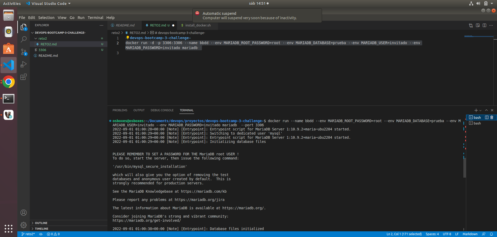
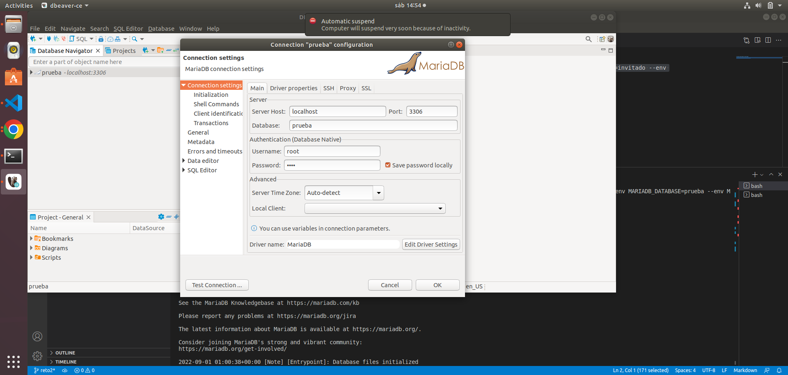
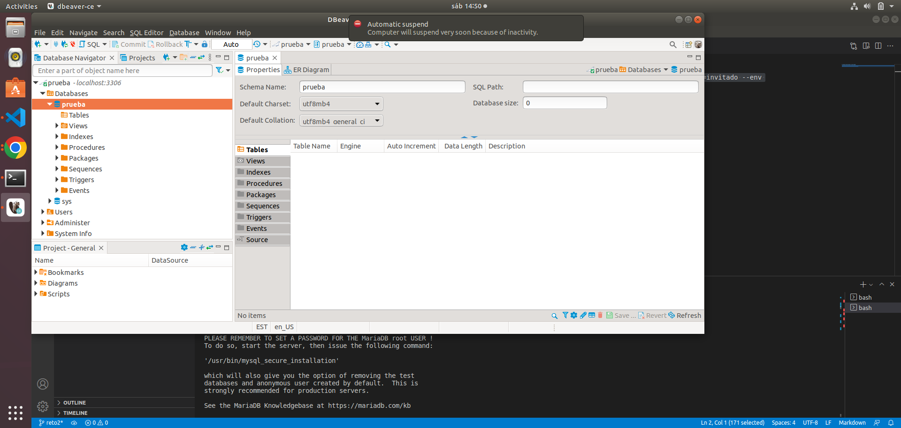
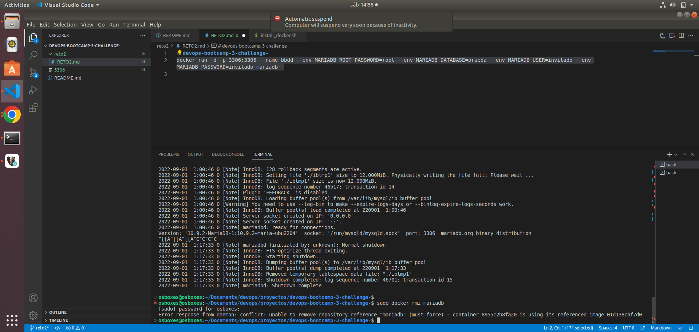

# devops-bootcamp-3-challenge-

#Challenge 3 - Introducción de Docker

##Reto 2

1. Arrancar un contenedor que se llame bbdd y que ejecute una instancia de la imagen mariadb para que sea accesible desde el puerto 3306. Establecer variables de entorno.

2. Pantallazo de la conexión al servidor de base de datos con el usuario creado y de la base de datos prueba creada automáticamente.

3. Pantallazo donde se comprueba que no se puede borrar la imagen mariadb mientras el contenedor bbdd está creado.

